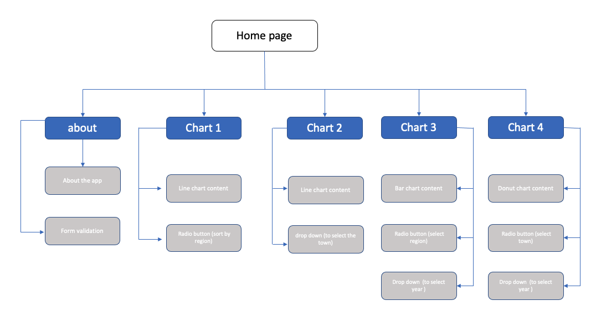

# Resale go where

    
    

## Project Summary

**Project Context**

Resale Go Where is a website developed to provide users with information to see the average price of resale flat in Singapore. The web application consist of charts that depicts the average transacted resale flat price trend from 2012 to 2022 feb, the least to most expensive flat type in individual town and number of different flat type transacted each year.

**Organization Goals**

The web app objective is to provide pricing information and the number of transacted flat type in each town to user/couples who would like to purchase resale flat instead of BTO.

**User Goals**

The aim of users is to obtain pricing inforamtion of resale flat from past year and use it as future reference/guide to purchase HDB flats in singapore. 

**Justification for the App**

The gov data sg provides dataset on pricing for different location. However, no data visualisation on the resale flat price were provided and hard for user to see consolidate the information for reference (the raw data has 10 thousand over records). Hence, having a chart that display average price trend would give user a easlier time to review the past year resale flat pricing.     

## UX/UI

### **Strategy**

_Orgranisation_
* objective: Provide a data visualiation on the past year average resale flat pricing 

_User_
* Objective: To get the insight on the past year resale flat price and trend, so that user can know which location has the highest resale value and also serve a reference for people who wants to purchase resale flat.

User stories | Acceptance Criteria
-------------|--------------------
As a user, I want to know the past 10 years average resale flat price | feature that display a line graph that enable user to review past 10 years average resale flat price.
As a user, I want to see the average reslae flat price by town region so that I can compare price between different town that is with in the same region | feature that will sort towns by region and only display the average resale flat price line graph by region when a particular region is selected.  
As a user, I want to see the price of different flat type in particular town | feature that will display line graph of different flat types of the average resale flat pricing in a particular town.

### **Scope**

_Functional Specifications_
1. Users will be able to see the past year average resale flat pricing through a line chart plot
2. Users will be able to see the past year average resale flat pricing sorted by town
3. User will see the number of transacted resale flat sorted by town and year

_Non-functional:_
1. mobile responsive 
2. performanace requirement - (how fast would the data be fetch back from axios)

### **Structure**

    
    <!--  -->

1. The Resale Go where is using a tree hierarchy.

2. When the user first load in the application, they will see the about main page. There is a guide for user to click on each chart to view different set of charts 

3. The nav-bar contains link to the homepage and developer github page 

4. when user click the chart button in the about main page, a swap in animation would occur and change to the respective chart that the user have selected.

5. when user click on the radio button of in the chart page, the web application will search and sort the past year dataset base on the selected criteria, and output the respective base on the selected criteria

6. when user click on the dropdown and selected the a particular year, the web application will search and sort the past year dataset by the current selected year and current town/region, and output the result base on the selected criteria

### **Skeleton**

**Main page (Web)**

    

**mobile view page**

    

### **Surface**

_color_
1. For colour used in the webpage, the body of the page uses the linear-gradient(to right, #def3ef, #ebedfa); 

    

2. For the front page image, background also uses a mixture of blue and light green to blend in with the background color of the application

_Font choice_

3. For font, Helvetica is used for logo and the content. The decision behind using Helvetica is because this font is consider one of the most easy to read.

_Icon_

4. The only icon used in the page is menu icon for the nav bar. The intented web design is to have least amount of icons, and the reason behind is to keep the web page minimalistic, clean and simple.  

### ***Features**

1. _Chart_

ApexCharts is used to display datasets that were sorted by the appliction from data.gov

2. _Sort chart by year, region/town location_

The application is able to sort and display chart results base on town location and year, so that user can see the price trend of the past transacted resale flats in line and donut chart.

3. _Synchronize chart_

From the chart, user will be able to review and compare pricing between different town and different year through the synchronization chart feature.

_Limitation and future implementation_

* In the future, add map feature can be added to the application so that user can get a better idea on the location of the past transacted resale flat information.

* The current resale flat dataset is not in real time and the number of query data have to be hardcoded.

* Currently the application would take about 5 seconds time to preprocess the data and render the charts. Hence, would need a better algo design for further implementation.

### **Technologies and Credits

* HTML5, CSS3 and Javascript were used

* gov data sg provided the datasets [here](https://data.gov.sg/dataset/resale-flat-prices?view_id=093ff0f0-783f-4f6a-be52-7e506a8c58ca&resource_id=f1765b54-a209-4718-8d38-a39237f502b3)

* linear serach and hashmap is mostly used as the algo for the application

* axios cdn was used for retrieving data.

* Apexchart API was used to display the graph

* Paul's Github source code were used as references

* Images for the webpage from pexel.com, google images 

### **Testing**

please click on the test link to access the pdf for 
test case [here](https://github.com/henryheyhey92/FlatRespository/blob/main/pdf/resale_go_where.pdf)

### ***Deployment**

Method of deployment uses github pages
1. go to the project repository
2. click on settings
3. scroll down and look for "GitHub Pages"
4. under source, click on the dropdown beside the root dropdown, and select the branch the main branch.
